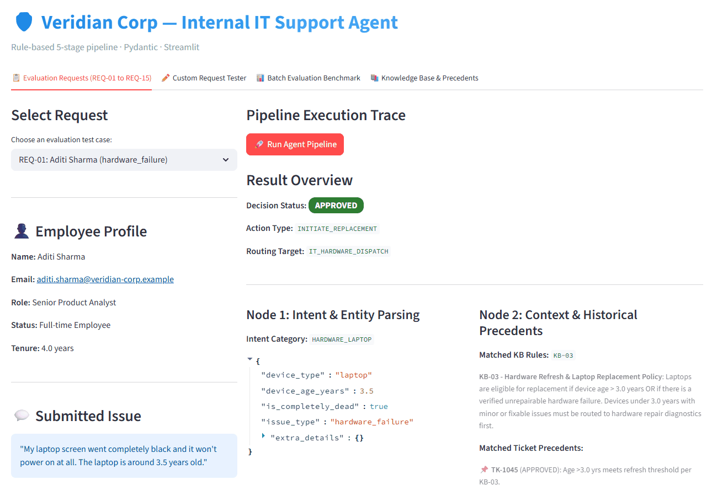
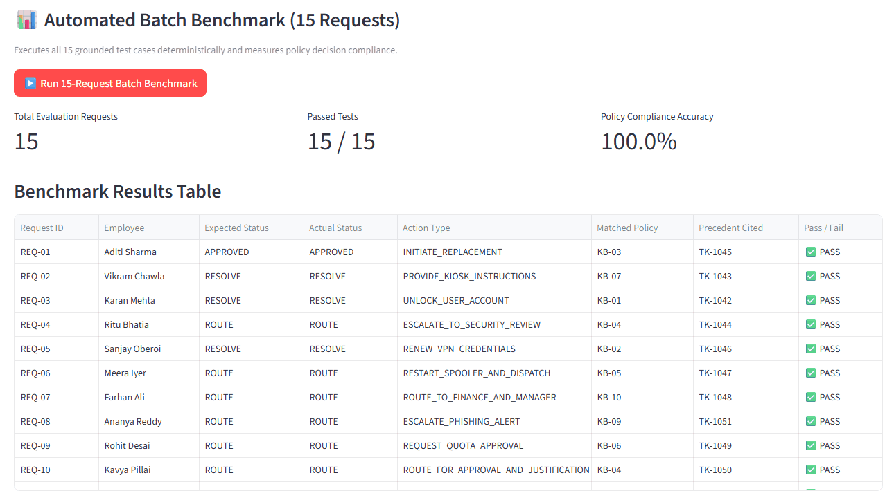

# 🛡️ IT Support Agent: a rule-based policy engine

[](https://github.com/gilgamish-hub/Veridian-Corp-/actions/workflows/tests.yml)


An agent that handles internal IT requests for a fictional company, Veridian Corp: unlocking accounts, renewing VPN access, replacing laptops, escalating phishing reports and routing everything else to the right team.

**Why rules and not an LLM?** These actions change real accounts and follow written company policy. A language model that is right 95% of the time will sometimes unlock an account it shouldn't, and it can't always explain why. Here every decision is made by explicit rules, cites the policy it applied, and is logged for audit.



---

## How it works

Each request passes through five stages. The state between them is a typed Pydantic model, so every stage's output can be inspected.

| Stage | What it does |
|---|---|
| 1. Parse | Finds the intent (`HARDWARE`, `ACCESS`, `SOFTWARE`, `SECURITY`) and details such as laptop age, mailbox size or asset tag, using keyword and regular-expression rules |
| 2. Retrieve | Looks up the matching policies (10 knowledge-base rules, `KB-01` to `KB-10`) and similar past tickets (10 precedents) |
| 3. Decide | Applies the policy rules and picks one outcome: `APPROVED`, `RESOLVE`, `ROUTE`, `CLARIFY` or `UNALLOWABLE` |
| 4. Act | Runs the matching tool, such as `unlock_user_account`, `renew_vpn_credentials`, `dispatch_replacement_laptop` or `send_security_alert` (10 tools in total) |
| 5. Respond | Writes the reply from templates, citing the policy and precedent used |

An LLM could later take over stages 1 and 5 (understanding messy requests and writing friendlier replies) without touching the decision logic in stage 3.

---

## Testing

- **17 Pytest tests** cover the parser, the policy rules and the tools.
- The app's **batch benchmark** runs 15 scripted requests and compares each decision with the expected one. All 15 match.

The rules were written for these 15 scenarios, so 15/15 shows the rules do what the policies say, not that the agent handles any request. New kinds of requests need new rules, and the **Custom Request Tester** tab shows how the agent treats text it hasn't seen.



---

## Run it

```bash
git clone https://github.com/gilgamish-hub/Veridian-Corp-.git
cd Veridian-Corp-
pip install -r requirements.txt

streamlit run src/app.py      # the web app
pytest tests                  # the test suite
```

The app has four tabs: the 15 evaluation requests with a full pipeline trace, a tester for your own requests, the batch benchmark (with JSON/CSV audit-log export), and the knowledge base with past tickets.

---

## Project structure

```text
├── data/
│   └── data_pack.json        # knowledge base, past tickets and the 15 requests
├── src/
│   ├── app.py                # Streamlit app
│   ├── engine.py             # the 5-stage pipeline
│   ├── schemas.py            # Pydantic state models
│   └── tools.py              # action tools and audit-log export
├── tests/
│   └── test_agent.py         # Pytest suite
└── docs/
    ├── architecture.md       # design and state schema
    ├── decision-mapping.md   # which request leads to which decision
    ├── explained-simply.md   # plain-language walkthrough
    ├── architecture-diagram.pdf
    └── presentation.pptx
```

---

## Author

Jatin Pal · [Portfolio](https://gilgamish-hub.github.io) · [LinkedIn](https://www.linkedin.com/in/jatin-pal-ba41a828a/)
